<div align="center">

# 宝宝记录 BabyRecord 🍼

**为宝宝自制的一款安卓成长记录 App**
本地优先 · 零广告 · 无推荐打扰

[](LICENSE)


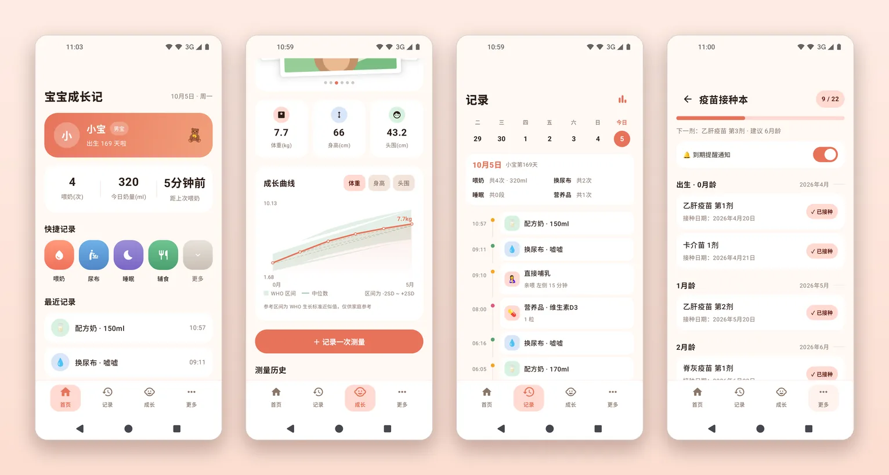

</div>

> 记录数据全部保存在本机 Room 数据库；云备份与家庭同步均为可选项，服务器与账号信息完全由你自己配置、仅存本机。

## 截图

> 以下截图均为 App 在 **Android 模拟器**上运行的实际界面，使用的是**示例数据**（宝宝"小宝"及示例记录），相册中的图片为示意插画，并非真实宝宝照片。

<table>
  <tr>
    <td align="center" width="33%">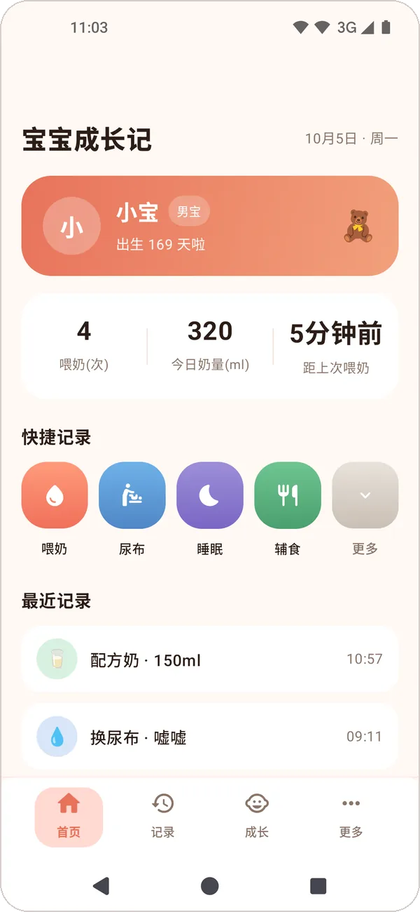<br><sub><b>今日</b><br>档案卡 · 日龄 · 今日喂养统计 · 快捷记录</sub></td>
    <td align="center" width="33%">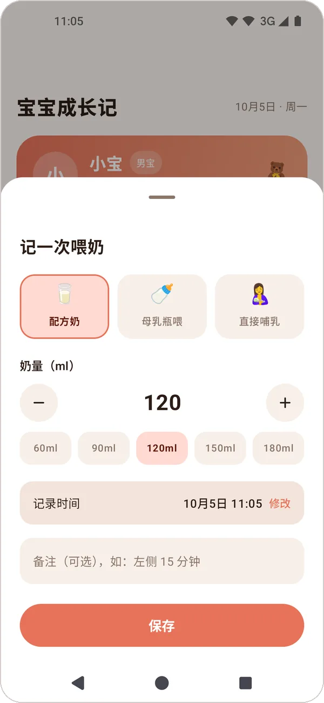<br><sub><b>快捷记录</b><br>配方奶 / 母乳瓶喂 / 亲喂，几下点完</sub></td>
    <td align="center" width="33%">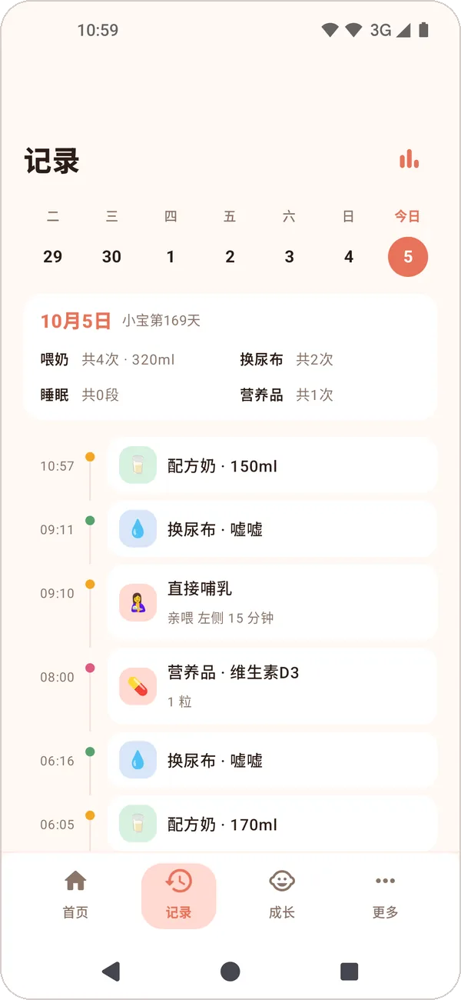<br><sub><b>成长时间线</b><br>按天分组回看全部记录</sub></td>
  </tr>
  <tr>
    <td align="center">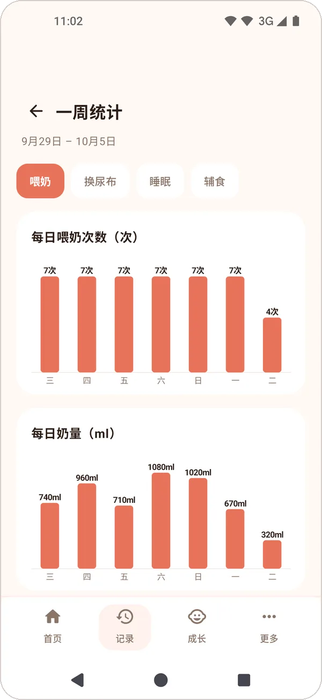<br><sub><b>统计</b><br>喂养次数 / 奶量等一周图表</sub></td>
    <td align="center">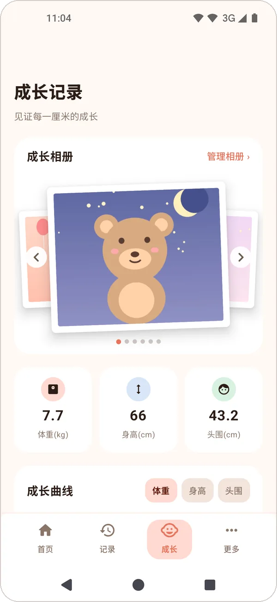<br><sub><b>成长记录</b><br>最新体重、身高、头围与成长相册</sub></td>
    <td align="center">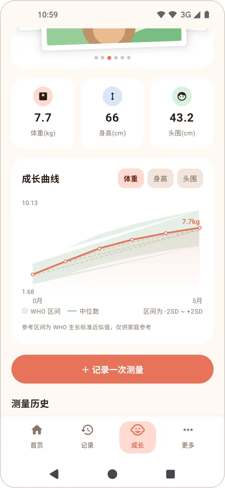<br><sub><b>成长曲线</b><br>Canvas 手绘曲线，对标 WHO 生长标准</sub></td>
  </tr>
  <tr>
    <td align="center">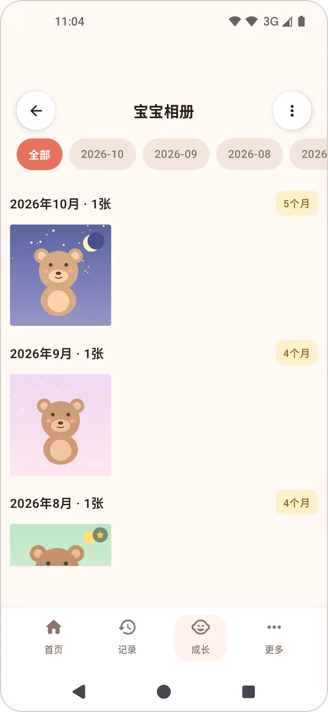<br><sub><b>相册</b><br>按月份分组的照片时间轴</sub></td>
    <td align="center">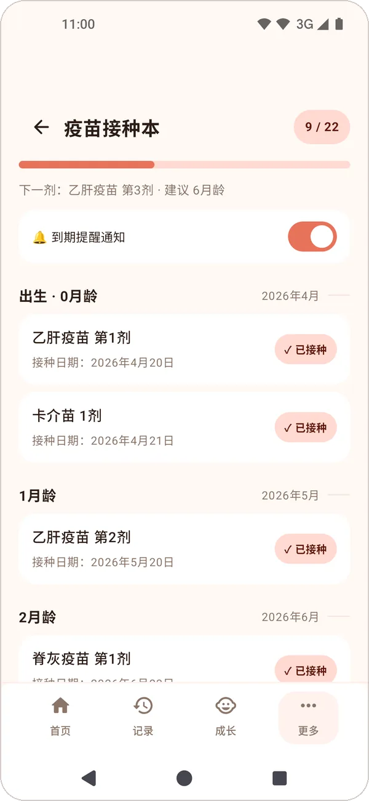<br><sub><b>疫苗接种本</b><br>国家免疫规划 22 剂，自动推算接种时间</sub></td>
    <td align="center">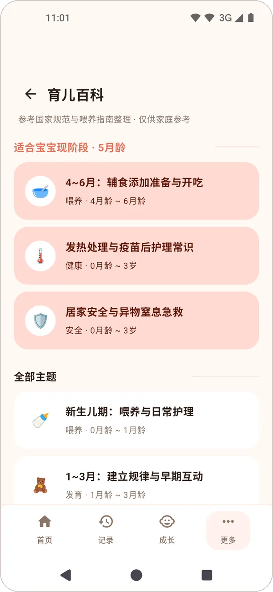<br><sub><b>育儿百科</b><br>按月龄推荐的喂养与护理知识</sub></td>
  </tr>
  <tr>
    <td align="center">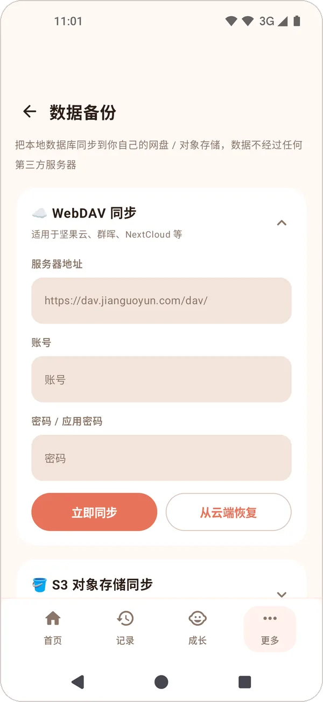<br><sub><b>云备份</b><br>WebDAV / S3 兼容存储</sub></td>
    <td align="center">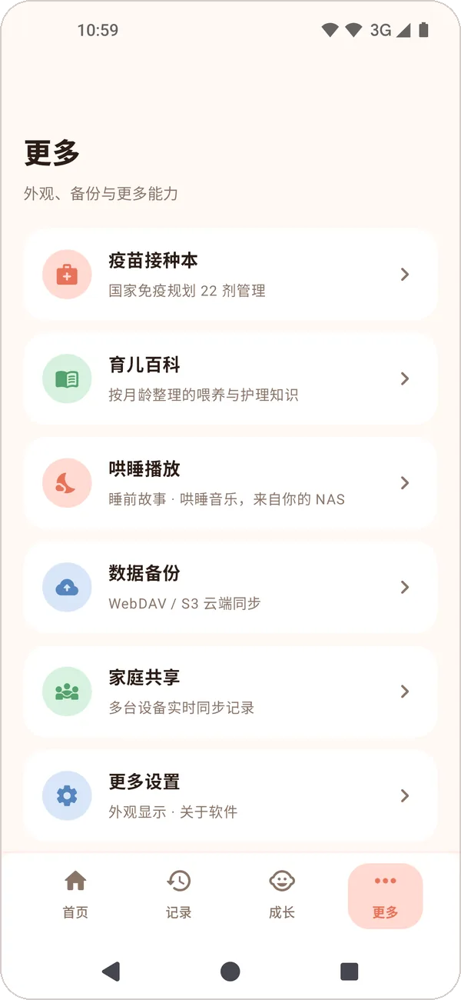<br><sub><b>更多</b><br>疫苗、百科、备份、家庭共享入口</sub></td>
    <td></td>
  </tr>
</table>

## 设计理念

- **本地优先**：所有记录保存在本机 Room 数据库，不依赖任何账号
- **零广告、无推荐打扰**：只做记录和回看
- **数据自己说了算**：云备份与家庭同步均为可选，服务器与账号信息由你自己配置、仅存本机

## 功能

### 📝 日常记录
- **今日**：宝宝档案卡（日龄）、今日喂养统计（次数 / 奶量 / 距上次）、快捷记录入口
- **快捷记录**：喂奶（亲喂 / 母乳瓶喂 / 配方奶）、辅食、换尿布、睡眠、补剂
- **成长时间线**：全部记录按天分组回看，支持查看详情与删除
- **统计**：喂养、睡眠等维度的统计图表

### 🌱 成长与健康
- **成长曲线**：体重 / 身高 / 头围登记，Canvas 手绘曲线，对标 WHO 生长标准
- **疫苗接种本**：内置国家免疫规划疫苗儿童免疫程序（2021 版，22 剂），按宝宝生日自动推算
  每剂的"建议接种时间"，到期未种标红提醒
- **百科**：内置育儿百科知识

### 📸 回忆
- **相册**：宝宝照片 / 视频时间轴，内置音乐播放卡片（后台播放）

### 🔧 工具与同步
- **桌面小部件**：4×4 综合小部件 + 快捷记录小部件，不进 App 也能看今日概览
- **云备份**：支持 WebDAV（坚果云等）与 S3 兼容存储
- **家庭同步**：可选的自建服务端多设备同步（HTTP + WebSocket），宝爸宝妈各自手机共享记录
- **主题**：暖色 Material 3 主题

## 技术栈

Kotlin + Jetpack Compose (Material 3) + Room + Navigation Compose + ViewModel/StateFlow
+ WorkManager + Glance (App Widget) + Media3 + OkHttp + Coil + kotlinx-serialization。

## 构建

- Android Studio 直接打开本项目目录即可（JDK 17+，AGP 8.7.3 / Kotlin 2.0.21 / Gradle 9.3 / compileSdk 35）
- 命令行：`gradlew.bat :app:assembleDebug`（需 JAVA_HOME 指向 JDK 17+，`local.properties` 指向 Android SDK）

## 下载

前往 [Releases](../../releases) 下载最新 APK。

## 目录速览

```
app/src/main/java/com/babyrecord/app/
├── data/          Room 实体、DAO、数据库与迁移
├── media/         相册媒体、音乐播放服务
├── sync/          家庭同步网络层（HTTP + WebSocket）
├── widget/        Glance 桌面小部件
└── ui/
    ├── AppRoot.kt      导航骨架、底部导航、全局弹层
    ├── home/           首页 + 各类快捷记录面板
    ├── timeline/       成长时间线
    ├── growth/         测量 + 成长曲线
    ├── vaccine/        疫苗接种本
    ├── stats/          统计
    ├── album/          相册
    ├── knowledge/      百科
    ├── backup/         云备份
    ├── detail/         记录详情
    ├── more/           更多（家庭同步设置等）
    └── theme/          暖色 Material 3 主题
```

## 许可

[MIT](LICENSE)
